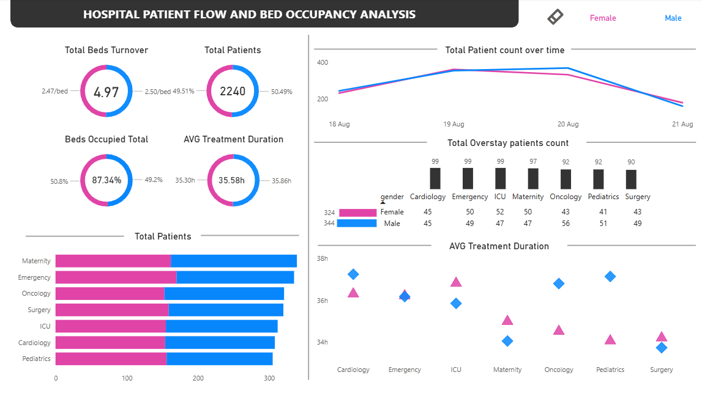
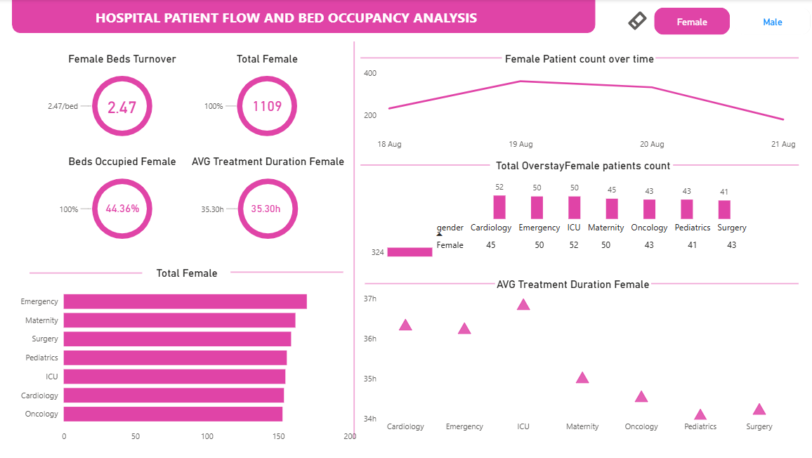
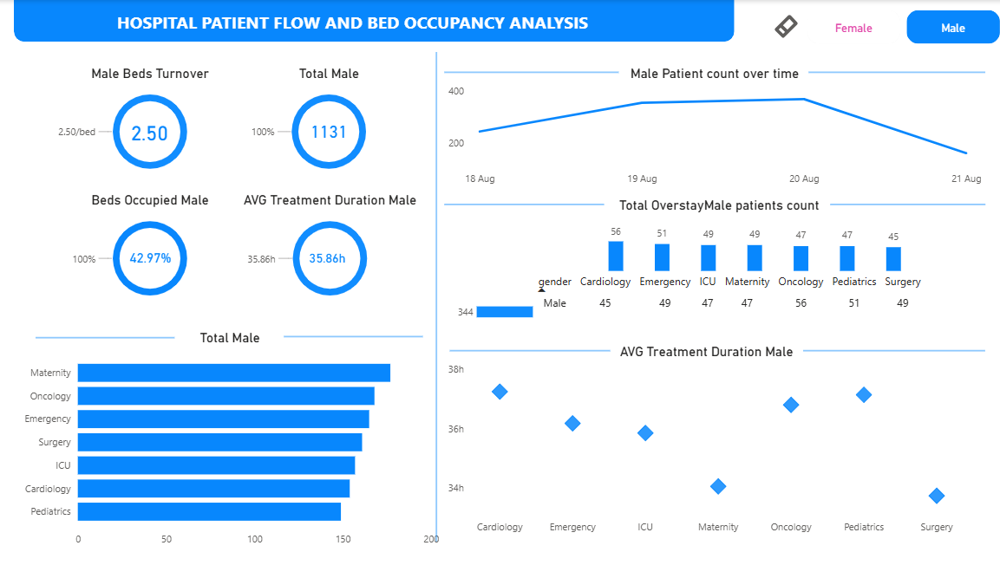

# 📊 Real-Time Patient Flow Analytics on Azure

---

## 🚀 Data Pipeline

---

## 📊 Dashboard Insights
This dashboard provides real-time insights into patient flow across departments.

### 🏥 Overall Dashboard
  
*Overview of hospital operations*

### 👩 Female Patients Analysis
  
*Insights focused on female patient data*

### 👨 Male Patients Analysis
  
*Insights focused on male patient data*

---

## 📑 Table of Contents
- 📌 Project Overview
- 🎯 Objectives
- 📂 Project Structure
- 🛠️ Tools & Technologies
- 📐 Data Architecture
- ⭐ Star Schema Design
- ⚙️ Step-by-Step Implementation
- 📊 Data Analytics & Dashboard
- ✅ Key Outcomes
---

## 📌 Project Overview
This project demonstrates a real-time data engineering pipeline for healthcare, designed to analyze patient flow across hospital departments using Azure cloud services.  

The pipeline ingests streaming data, processes it in Databricks (PySpark), and stores it in Azure Synapse SQL Pool for analytics and visualization.

**Part 1 – Data Engineering:** Build the real-time ingestion + transformation pipeline  
**Part 2 – Analytics:** Connect Synapse to Power BI and design an interactive dashboard for hospital KPIs  

---

## 🔁 Pipeline Architecture
**Flow:**  
Data Source → Event Hub (Kafka) → Databricks (Bronze/Silver/Gold) → Synapse SQL Pool → Power BI  

**Security:**  
Azure Key Vault + Azure AD protect all credentials and access control throughout the pipeline  

---

## 🎯 Objectives
- Collect real-time patient data via Azure Event Hub  
- Process and cleanse data using Databricks PySpark (Bronze → Silver → Gold layers)  
- Implement a Star Schema in Synapse SQL Pool for efficient querying  
- Build a live Power BI dashboard for hospital KPIs  
- Enable full Version Control with Git  

---

## 📂 Project Structure

Real-Time-Patient-Flow-Analytics-on-Azure/
│
├── 01_bronze_rawdata.py
├── 02_silver_cleandata.py
├── 03_gold_transform.py
│
├── patient_flow_generator.py
│
├── SQL_pool_quries.sql
├── SQL_views_DDL.sql
│
├── Hospital_Dashboard.pbix
│
├── client_requirements_detail.pdf
├── Pipeline.png
├── DashBoard.png
├── FemaleDashBoard.png
├── MaleDashBoard.png
└── README.md

---

## 🛠️ Tools & Technologies

| Tool | Purpose |
|------|--------|
| Azure Event Hub | Real-time data ingestion via Kafka protocol |
| Azure Databricks | PySpark-based ETL |
| Azure Data Lake Storage Gen2 | Data storage |
| Azure Synapse SQL Pool | Data warehouse |
| Azure Key Vault / Azure AD | Security |
| Power BI | Dashboarding |
| Python 3.9+ | Programming |
| Git | Version control |

---

## 📐 Data Architecture
The pipeline follows a **Medallion architecture**:

Data Source → Event Hub → Databricks → Bronze → Silver → Gold → Synapse → Power BI

- **Bronze Layer:** Raw JSON data  
- **Silver Layer:** Cleaned & validated  
- **Gold Layer:** Business-ready Star Schema  

---

## ⭐ Star Schema Design
- **Fact Table:** FactPatientFlow  
- **Dimensions:**  
  - DimPatient  
  - DimDepartment  

---

## ⚙️ Step-by-Step Implementation

### 1. Event Hub Setup
- Created Event Hub namespace  
- Configured consumer groups  

### 2. Data Simulation
- Streams synthetic data using Kafka  
- Includes dirty data injection  

### 3. Storage Setup
- ADLS Gen2 containers: bronze, silver, gold  

### 4. Databricks Processing

| File | Layer | Description |
|------|------|------------|
| 01_bronze_rawdata.py | Bronze | Raw ingestion |
| 02_silver_cleandata.py | Silver | Cleaning |
| 03_gold_transform.py | Gold | Star schema |

### 5. Synapse SQL Pool
- External tables + analytical views  
- KPI-based reporting  

### 6. Version Control
- Full Git tracking with commits  

---

## 📊 Data Analytics & Dashboard

Connected Synapse SQL Pool to Power BI via DirectQuery.

### 📈 Full Dashboard
*(Already shown above)*

### 👩 Female Dashboard
*(Already shown above)*

### 👨 Male Dashboard
*(Already shown above)*

---

## 📌 Dashboard KPIs

| KPI | Value |
|-----|------|
| Total Beds Turnover | 4.97 |
| Total Patients | 2,240 |
| Beds Occupied | 87.34% |
| Avg Treatment Duration | 35.58 hrs |

---

## ✅ Key Outcomes

| Outcome | Detail |
|--------|-------|
| Latency Reduced | From 24 hrs → <5 mins |
| Pipeline | End-to-end real-time |
| Data Quality | Handled in Silver layer |
| Architecture | Scalable Medallion |
| Insights | Real-time hospital analytics |
| Portfolio Value | Strong Data + Cloud project |

