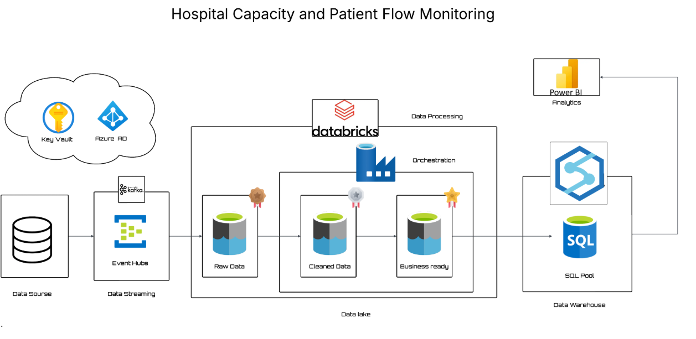

Real-Time Patient Flow Analytics on Azure

## 🚀 Data Pipeline

📑 Table of Contents

📌 Project Overview
🎯 Objectives
📂 Project Structure
🛠️ Tools & Technologies
📐 Data Architecture
⭐ Star Schema Design
⚙️ Step-by-Step Implementation
📊 Data Analytics & Dashboard
✅ Key Outcomes
📜 License

📌 Project Overview
This project demonstrates a real-time data engineering pipeline for healthcare, designed to analyze patient flow across hospital departments using Azure cloud services.
The pipeline ingests streaming data, processes it in Databricks (PySpark), and stores it in Azure Synapse SQL Pool for analytics and visualization.

Part 1 – Data Engineering: Build the real-time ingestion + transformation pipeline.
Part 2 – Analytics: Connect Synapse to Power BI and design an interactive dashboard for hospital KPIs.

🔁 Pipeline Architecture
Show Image

Flow: Data Source → Event Hub (Kafka) → Databricks (Bronze/Silver/Gold) → Synapse SQL Pool → Power BI
Security: Azure Key Vault + Azure AD protect all credentials and access control throughout the pipeline.

🎯 Objectives

Collect real-time patient data via Azure Event Hub
Process and cleanse data using Databricks PySpark (Bronze → Silver → Gold layers)
Implement a Star Schema in Synapse SQL Pool for efficient querying
Build a live Power BI dashboard for hospital KPIs
Enable full Version Control with Git

📂 Project Structure
Real-Time-Patient-Flow-Analytics-on-Azure/
│
├── 01_bronze_rawdata.py           # Raw ingestion from Event Hub → ADLS Bronze
├── 02_silver_cleandata.py         # Data cleaning & validation
├── 03_gold_transform.py           # Star schema transformation → Gold layer
│
├── patient_flow_generator.py      # Streams fake patient events to Event Hub
│
├── SQL_pool_quries.sql            # External table DDL (Fact + Dimensions)
├── SQL_views_DDL.sql              # 7 KPI & chart views for Power BI
│
├── Hospital_Dashboard.pbix        # Power BI dashboard file
│
├── client_requirements_detail.pdf # Client requirements document
├── Pipeline.png                   # Architecture diagram
├── DashBoard.png                  # Full dashboard screenshot
├── FemaleDashBoard.png            # Dashboard filtered – Female patients
├── MaleDashBoard.png              # Dashboard filtered – Male patients
└── README.md

🛠️ Tools & Technologies
ToolPurposeAzure Event HubReal-time data ingestion via Kafka protocolAzure DatabricksPySpark-based ETL (Bronze → Silver → Gold)Azure Data Lake Storage Gen2Staging raw and curated dataAzure Synapse SQL PoolData warehouse for analytics queriesAzure Key Vault / Azure ADSecrets management & access controlPower BIInteractive dashboarding & KPI visualizationPython 3.9+Core programming & data simulationGitVersion control

📐 Data Architecture
The pipeline follows a multi-layered Medallion architecture:
Data Source → Event Hub (Kafka) → Databricks
                                      │
                              ┌───────▼────────┐
                              │  Bronze Layer  │  ← Raw JSON from Event Hub
                              │   (Raw Data)   │
                              └───────┬────────┘
                                      │
                              ┌───────▼────────┐
                              │  Silver Layer  │  ← Cleaned & validated
                              │ (Cleaned Data) │
                              └───────┬────────┘
                                      │
                              ┌───────▼────────┐
                              │   Gold Layer   │  ← Star schema, BI-ready
                              │(Business Ready)│
                              └───────┬────────┘
                                      │
                             Synapse SQL Pool → Power BI

Bronze Layer: Raw JSON data from Event Hub stored in ADLS as-is with ingestion timestamp
Silver Layer: Cleaned and structured — invalid ages filtered, future timestamps removed, nulls dropped, duplicates handled
Gold Layer: Transformed into Star Schema, ready for BI consumption

⭐ Star Schema Design
              ┌──────────────────┐
              │   DimPatient     │
              │  - surrogate_key │
              │  - patient_id    │
              │  - gender        │
              │  - age           │
              │  (SCD Type 2)    │
              └────────┬─────────┘
                       │
┌───────────────┐  ┌───▼──────────────────────────┐
│ DimDepartment │  │       FactPatientFlow         │
│ - surrogate   │◄─│  - fact_id                   │
│ - department  │  │  - patient_sk                 │
│ - hospital_id │  │  - department_sk              │
└───────────────┘  │  - admission_time             │
                   │  - discharge_time             │
                   │  - length_of_stay_hours       │
                   │  - is_currently_admitted      │
                   │  - bed_id                     │
                   └───────────────────────────────┘

Fact Table: FactPatientFlow — patient visits, timestamps, length of stay, discharge status
Dimension Tables:

DimPatient – Patient demographic info with SCD Type 2 history tracking
DimDepartment – Department details & hospital mapping

⚙️ Step-by-Step Implementation
1. Event Hub Setup

Created Event Hub namespace and patient-flow hub in Azure Portal
Configured consumer groups for Databricks streaming

2. Data Simulation

patient_flow_generator.py streams synthetic patient events via Kafka producer at 1 event/sec
Covers 7 departments across 7 hospitals
Includes dirty data injection (5% chance each): invalid ages (101–150) and future-dated admissions to test Silver layer cleaning

3. Storage Setup

Configured Azure Data Lake Storage Gen2
Created containers: bronze, silver, gold

4. Databricks Processing
NotebookLayerWhat it does01_bronze_rawdata.pyBronzeReads Event Hub stream, parses JSON schema, writes raw Parquet to ADLS02_silver_cleandata.pySilverFilters invalid ages, removes future timestamps, drops nulls, standardizes gender03_gold_transform.pyGoldBuilds DimPatient (SCD2), DimDepartment, FactPatientFlow as Star Schema
5. Synapse SQL Pool

Created dedicated SQL Pool in Azure Synapse
SQL_pool_quries.sql — creates external tables pointing to Gold layer Parquet files in ADLS
SQL_views_DDL.sql — creates 7 analytical views used directly by Power BI

ViewKPIvw_bed_occupancyBed occupancy % by gendervw_bed_turnover_rateBed reuse rate by gendervw_patient_demographicsTotal active patients by gendervw_avg_treatment_durationAvg hours per department & gendervw_patient_volume_trendPatient count over timevw_department_inflowActive patients per departmentvw_overstay_patientsPatients admitted over 50 hours
6. Version Control

Full project tracked with Git
Each layer committed separately with descriptive messages for clean history

📊 Data Analytics & Dashboard
Once the Star Schema was live in Synapse SQL Pool, Power BI was connected via DirectQuery for real-time dashboard updates.
🔗 Synapse → Power BI Connection

Connected Azure Synapse SQL Pool to Power BI via direct SQL connection
Imported FactPatientFlow and all Dimension tables
Established Star Schema relationships for optimized reporting

📈 Full Dashboard — Combined View
Show Image

👩 Female Patient View
Show Image

👨 Male Patient View
Show Image

📌 Dashboard KPIs at a Glance
KPIValue🛏️ Total Beds Turnover4.97 per bed👥 Total Patients2,240📊 Beds Occupied87.34%⏱️ Avg Treatment Duration35.58 hours🏥 DepartmentsEmergency, Surgery, ICU, Pediatrics, Maternity, Oncology, Cardiology🔍 Gender SlicerMale / Female drill-down across all visuals

✅ Key Outcomes
OutcomeDetailLatency ReducedFrom 24-hour manual reports to under 5-minute real-time dashboardEnd-to-End PipelineReal-time ingestion → transformation → warehouse → analyticsData QualityDirty data handled automatically in Silver layerScalable ArchitectureMedallion pattern adaptable to any hospital datasetBusiness InsightsAdmins monitor bed usage, patient flow and department bottlenecks in real timePortfolio ValueDemonstrates Data Engineering + Analytics + Cloud skills in one project
